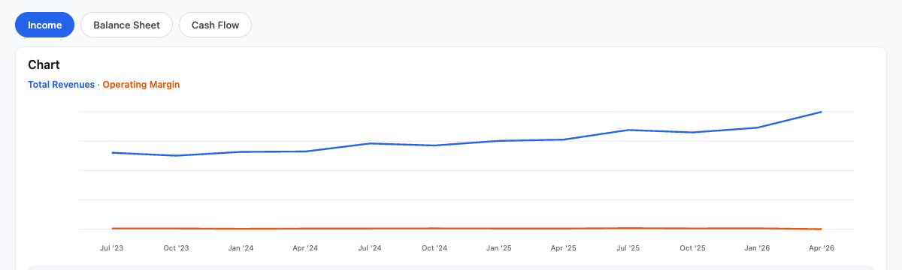
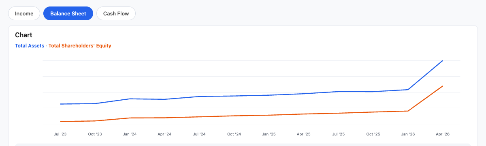
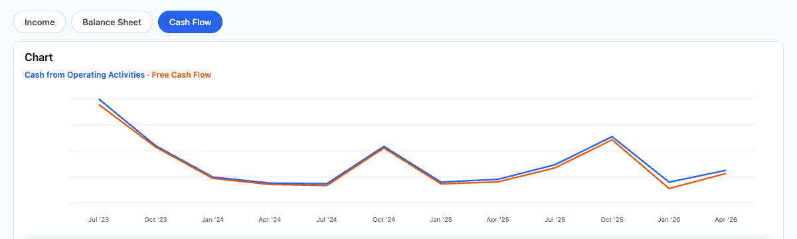

# Stock Financials

See **Income**, **Balance Sheet**, and **Cash Flow** for any US stock — last **12 quarters**, from official **SEC filings**, in a tabbed interactive table.

Works with **Cursor**, **Claude Code**, or on its own — no coding required.

---

## At a glance

| | One-time setup | Day-to-day use |
|---|----------------|----------------|
| **When** | Once, before your first stock | Every time you want financials |
| **What you do** | Download the folder → double-click **Setup.command** | **Ask your AI assistant** (or use a shortcut below) |
| **How long** | ~2 minutes | ~1 minute per ticker (first time); faster after that |
| **Run again?** | Only if you move to a new Mac or reinstall | Yes — any ticker, any time |

---

# Part 1 — One-time setup

Do this **once**. You should not need to run setup again unless you reinstall or switch computers.

### Step 1 — Get this folder on your Mac

**Option A — Download (easiest)**  
[github.com/mallik-mahalingam/stock-financials](https://github.com/mallik-mahalingam/stock-financials) → **Code** → **Download ZIP** → unzip.

**Option B — Git**

```bash
git clone https://github.com/mallik-mahalingam/stock-financials.git ~/src/stock-financials
```

### Step 2 — Run setup (one click)

In Finder, open the `stock-financials` folder and **double-click**:

```
Setup.command
```

Enter your **name** and **email** when asked. The SEC requires this for automated downloads. Setup saves your answers to `~/.stock-financials.env` — you won’t be asked again.

When prompted, say **yes** to link the AI skill (for Cursor). For **Claude Code**, add this repo’s `skills/` folder to your Claude skills path so the assistant knows how to run sync.

> **macOS blocked the file?** Right-click **Setup.command** → **Open** → **Open** again (only needed the first time).

### Step 3 — Confirm setup worked

You should see **“Setup complete!”** in the window. Close it. You’re done with Part 1 — never repeat these steps on this Mac.

---

# Part 2 — Day-to-day use

Use this **whenever** you want financials for a stock. No setup steps — just ask.

### Ask your AI assistant

In **Cursor**, **Claude Code**, or any AI tool with this skill installed, type something like:

> Get financials for Apple  
> Show me PANW income, balance sheet, and cash flow  
> `/stock-financials MSFT`

The assistant runs the sync, builds the table, and points you to the canvas file. Works after Part 1 is done once.

<small>

**Other ways**

· **Double-click** `Get Financials.command` → enter ticker (e.g. `AAPL`) → open the file it shows you under `canvas/`

· **Terminal:** `~/src/stock-financials/get-financials.sh AAPL`

</small>

---

## What the canvas looks like

After sync, you get **one file** with **three tabs** — **Income · Balance Sheet · Cash Flow**. In **Cursor**: summary stats at the top, **12 quarters** in the table, tick rows to chart them.

Real **PANW** example below — tables show the last 4 quarters (preview); the live canvas has **all rows × 12 quarters**.

### Income tab

| | Apr '26 | Jan '26 | Oct '25 | Jul '25 |
|--|---------|---------|---------|---------|
| **Total Revenues** | 3,002 | 2,594 | 2,474 | 2,536 |
| Total Revenues %Chg | +31.1% | +14.9% | +15.7% | +15.8% |
| **Gross Profit** | 2,028 | 1,909 | 1,836 | 1,856 |
| Gross Profit Margin | 67.6% | 73.6% | 74.2% | 73.2% |
| **Operating Profit** | (183) | 397 | 309 | 497 |
| **Consolidated Net Income** | (177) | 432 | 334 | 254 |
| Diluted EPS | (0.22) | 0.61* | 0.47 | 0.36 |

Chart (revenue + operating margin):



### Balance sheet tab

| | Apr '26 | Jan '26 | Oct '25 | Jul '25 |
|--|---------|---------|---------|---------|
| Cash and Cash Equivalents | 2,364 | 4,158 | 3,066 | 2,269 |
| **Total Current Assets** | 7,713 | 8,369 | 7,310 | 7,523 |
| **Total Assets** | 46,266 | 24,979 | 23,536 | 23,576 |
| **Total Current Liabilities** | 9,006 | 8,009 | 7,418 | 7,988 |
| **Total Liabilities** | 18,598 | 15,586 | 14,871 | 15,752 |
| **Total Shareholders' Equity** | 27,668 | 9,393 | 8,665 | 7,824 |

Chart (total assets + shareholders' equity):



### Cash flow tab

| | Apr '26 | Jan '26 | Oct '25 | Jul '25 |
|--|---------|---------|---------|---------|
| **Cash from Operating Activities** | 871 | 554 | 1,771 | 1,021 |
| Capital Expenditure | (83) | (170) | (84) | (86) |
| **Free Cash Flow*** | 788* | 384* | 1,687* | 935* |
| Cash from Investing Activities | (1,766) | 651 | (983) | (763) |
| Cash from Financing Activities | (899) | (114) | 8 | (374) |
| **Net Change in Cash** | (1,792) | 1,091 | 796 | (116) |

Chart (operating cash flow + free cash flow):



<small>

USD millions except EPS. `*` = derived line. Open the canvas in Cursor for the full statement and interactive charts.

</small>

---

## Ongoing habits

| Situation | What to do |
|-----------|------------|
| New stock you’ve never looked up | Ask your AI: *“Get financials for TICKER”* |
| Same stock, new quarter filed | Ask again with the same ticker (only re-downloads if SEC has newer data) |
| Canvas looks wrong or stale | Ask again — don’t edit files by hand |
| New Mac or fresh install | Repeat **Part 1** only |

---

## Reading the table

| You see | Meaning |
|---------|---------|
| `$2,257` | Dollars in **millions** |
| `(183)` | Loss / negative |
| `0.76` | Earnings per share |
| `47.0%` | Margin or year-over-year change |
| `*` | Estimated when the filing doesn’t report that line directly |

Open the `.canvas.tsx` file in **Cursor** for the interactive view (tabs + charts). The underlying data is also saved as JSON in `json-data/`.

---

## Something wrong?

| Problem | Fix |
|---------|-----|
| “Setup is not done yet” | You skipped Part 1 — run **Setup.command** once |
| AI doesn’t know what to do | Install the skill: Cursor via Setup, or add `skills/` for Claude |
| macOS won’t open `.command` file | Right-click → **Open** |
| “Python not installed” | Install from [python.org/downloads](https://www.python.org/downloads/), then run **Setup.command** again |
| Ticker not found | Use the US symbol (e.g. `BRK.B`) |

<small>

Saved data appears in `json-data/` and `canvas/` inside this folder (created automatically). Advanced CLI (`sync`, `check`, `build`) lives in `scripts/sec_financials.py`. Agent workflow details: `skills/SKILL.md`.

</small>

---

## About the data

Numbers come from **SEC EDGAR** (company 10-Q / 10-K filings). Some lines are calculated when filers don’t report them directly (marked with `*`).
